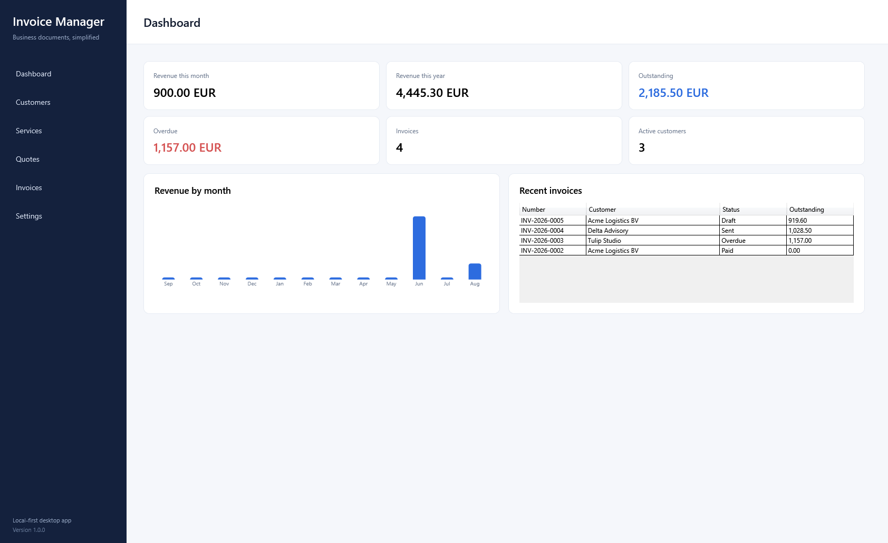
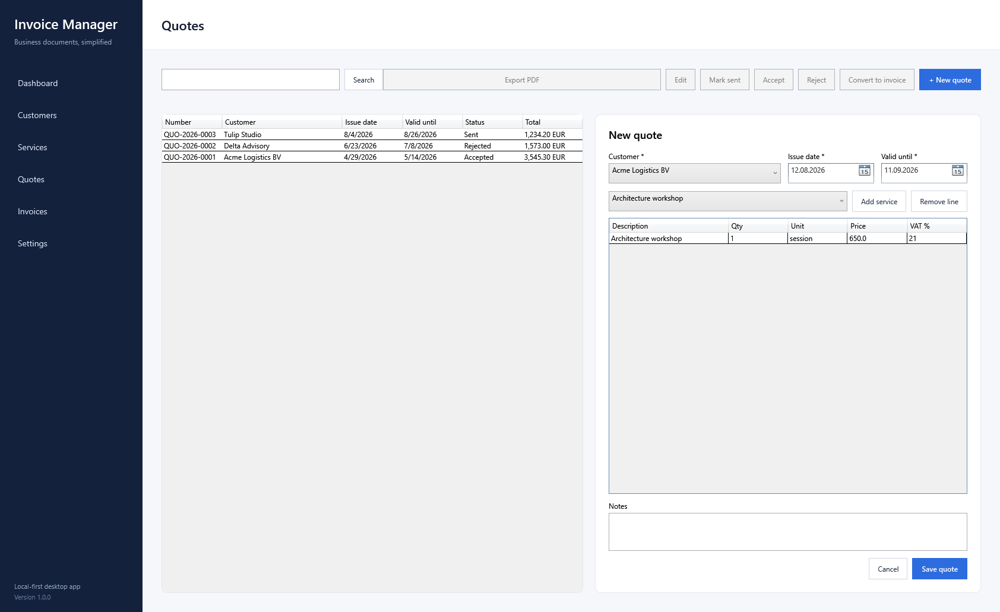
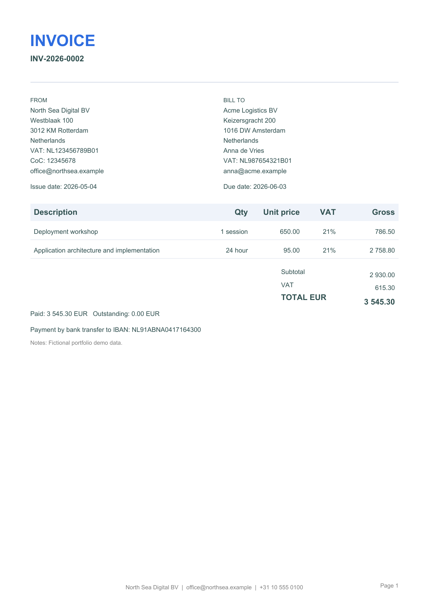

# Invoice Manager

Invoice Manager is a Windows desktop application for freelancers and small businesses that need a focused way to manage customers, services, quotations, invoices, payments, and basic financial reporting.


> Project status: `v1.0.0` portfolio release complete locally. The self-contained Windows package, release notes, screenshots, presentation assets, and publication workflow are ready; GitHub publication awaits a configured remote repository.

## Product Scope

The MVP supports one company profile and one currency (EUR). Its core workflow is:

```text
Configure company -> Create customer -> Create service -> Create quote
-> Accept quote -> Convert to invoice -> Generate PDF -> Register payment
-> Update dashboard
```

Invoice Manager is not intended to replace accounting software or an ERP system.

## Implemented Features

- Customer create, view, edit, archive, and search workflows
- Product and service create, edit, deactivate, and search workflows
- Local SQLite persistence with automatic migrations
- Single-company profile and document defaults
- Quotation creation, editing, item management, search, status tracking, automatic expiration, and yearly numbering
- Invoice creation, editing, item management, search, Draft/Sent/Cancelled lifecycle controls, and independent yearly numbering
- One-time atomic conversion from an accepted quotation to a linked invoice
- Recorded partial and full payments with outstanding balances, Paid and Overdue status, and overpayment protection
- Immutable payment history with reasoned voiding instead of editing or deletion
- Quote and invoice PDF export to a user-selected location
- Persisted historical company logos for reproducible document output
- Dashboard KPIs, recent invoices, and a 12-month payment-revenue chart
- Transactional fictional demo data that can only be loaded into an empty database
- Keyboard navigation, accessibility labels, empty states, validation feedback, and versioned release packaging

## Product Preview

| Dashboard | Quotation editor |
|---|---|
|  |  |



## Technology

| Area | Technology |
|---|---|
| Runtime | .NET 10 LTS |
| Language | C# |
| Desktop UI | WPF |
| UI pattern | MVVM with CommunityToolkit.Mvvm |
| Persistence | Entity Framework Core 10 and SQLite |
| PDF | PDFsharp 6.2.4 |
| Hosting and DI | Microsoft.Extensions.Hosting |
| Testing | xUnit |
| CI | GitHub Actions on Windows |

## Architecture

The application follows a layered architecture:

```text
InvoiceManager.App            WPF views, view models, navigation
        |
InvoiceManager.Application    Use cases and ports
        |
InvoiceManager.Domain         Entities, value objects, business rules

InvoiceManager.Infrastructure implements persistence, PDF, and storage ports
```

The Domain project has no dependencies. Business logic belongs in Domain or Application, never in WPF views, view models, or persistence code. See [Architecture](docs/architecture.md) and the [decision records](docs/decisions/README.md).

## Repository Layout

```text
src/        production projects
tests/      automated test projects
docs/       product and engineering documentation
.github/    CI and collaboration templates
```

The planned detailed layout is documented in [Architecture](docs/architecture.md).

## Getting Started

### Prerequisites

- Windows 10 or Windows 11
- [.NET 10 SDK](https://dotnet.microsoft.com/download/dotnet/10.0), version `10.0.302` or a compatible later patch

### Restore, Build, and Test

```powershell
dotnet tool restore
dotnet restore InvoiceManager.sln
dotnet build InvoiceManager.sln --no-restore --configuration Release
dotnet test InvoiceManager.sln --no-build --configuration Release
```

### Run the Desktop App

```powershell
dotnet run --project src/InvoiceManager.App/InvoiceManager.App.csproj
```

On startup, the application creates its directories and applies pending EF Core migrations automatically. The current UI includes the complete company-to-payment workflow, PDF export, and live financial dashboard reporting.

### Explore with Fictional Demo Data

Use a fresh or explicitly isolated database:

```powershell
dotnet run --project src/InvoiceManager.App/InvoiceManager.App.csproj -- --demo
```

The demo seeder refuses to run when any business data already exists. Its fictional companies, contacts, identifiers, and `.example` email addresses are safe for screenshots and evaluation.

### Build the Windows Release Package

```powershell
./scripts/publish-release.ps1
```

The script creates a self-contained `win-x64` folder and ZIP under `artifacts/release`.

## Local Data

Runtime data is stored under `%LocalAppData%/InvoiceManager`:

```text
invoice-manager.db
logs/invoice-manager.log
assets/
```

Generated PDFs are exported separately to a location selected by the user.

## Testing

The project has 97 automated tests covering financial calculations, document numbering, snapshots, payments, demo-data safety, PDF generation, dashboard reporting, status transitions, use cases, database constraints, paths, and migrations. See the [Testing Strategy](docs/testing-strategy.md).

## Documentation

- [Project overview](docs/project-overview.md)
- [Requirements](docs/requirements.md)
- [Architecture](docs/architecture.md)
- [Domain model](docs/domain-model.md)
- [Business rules](docs/business-rules.md)
- [Testing strategy](docs/testing-strategy.md)
- [Roadmap](docs/roadmap.md)
- [Portfolio case study](docs/case-study.md)
- [Presentation assets](docs/presentation-assets.md)
- [Version 1.0.0 release notes](docs/releases/v1.0.0.md)
- [Milestone reports](docs/milestone-reports/README.md)
- [Architecture decisions](docs/decisions/README.md)
- [Contributing](CONTRIBUTING.md)
- [Changelog](CHANGELOG.md)

## Roadmap

Development is split into seven completed milestones, from foundation through customers, quotes, invoices, payments, PDF generation, dashboard reporting, and portfolio polish. See the complete [Roadmap](docs/roadmap.md).

## License

A project license has not been selected yet. Until a license file is added, all rights are reserved.
