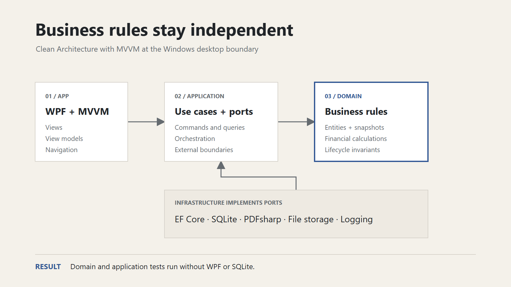

# Invoice Manager

Invoice Manager is a release-ready, local-first Windows business application implementing a complete quotation-to-payment workflow with transactional numbering, immutable historical snapshots, auditable payments, reproducible PDFs, and automated persistence testing.

**.NET 10 · WPF · MVVM · Clean Architecture · EF Core · SQLite**


> Project status: `v1.0.0` portfolio release complete locally. The self-contained Windows package, release notes, screenshots, presentation assets, and publication workflow are ready; GitHub publication awaits a configured remote repository.

## What It Solves

Freelancers and small businesses often duplicate customer, pricing, VAT, and payment data across spreadsheets and document templates. That approach makes status tracking fragile and can silently change historical output after a company address, customer record, service price, VAT rate, or logo is edited.

Invoice Manager keeps the workflow and its business history in one local SQLite database. It supports one company profile and EUR without requiring a cloud account, and deliberately stops short of accounting or ERP scope.

## Demo Workflow

```text
Configure company -> Create customer -> Create service -> Create quote
-> Accept quote -> Convert to invoice -> Generate PDF -> Register payment
-> Update dashboard
```

Run a safe fictional dataset against a new database with `--demo`. The seeder refuses non-empty business databases, so evaluation data cannot be mixed accidentally with existing records.

## Key Engineering Challenges

### Historical snapshots

Issued documents own persisted issuer, customer, line-item, and logo snapshots. Later edits affect new documents only, keeping historical PDFs reproducible.

### Transactional numbering and conversion

Yearly quote and invoice numbers are allocated only on first persistence. Sequence updates, aggregate persistence, and accepted-quote conversion are atomic, with database uniqueness constraints as a final safeguard.

### Recorded and auditable payments

Partial and full payments derive outstanding balances and invoice status. Records are immutable; an incorrect payment is voided once with a reason and UTC timestamp instead of rewriting history.

### Deterministic time

Business dates and UTC audit instants are separate concepts. An injected clock makes expiration, overdue, payment, and audit behavior repeatable in automated tests.

## Implemented Features

- Customer create, view, edit, archive, and search workflows
- Product and service create, edit, deactivate, and search workflows
- Local SQLite persistence with automatic migrations
- Single-company profile and document defaults
- Quotation creation, editing, item management, search, status tracking, automatic expiration, and yearly numbering
- Invoice creation, editing, item management, search, Draft/Sent/Cancelled lifecycle controls, and independent yearly numbering
- One-time atomic conversion from an accepted quotation to a linked invoice
- Recorded partial and full payments with outstanding balances, Paid and Overdue status, and overpayment protection
- Immutable payment history with reasoned voiding instead of editing or deletion
- Quote and invoice PDF export to a user-selected location
- Persisted historical company logos for reproducible document output
- Dashboard KPIs, recent invoices, and a 12-month payment-revenue chart
- Transactional fictional demo data that can only be loaded into an empty database
- Keyboard navigation, accessibility labels, empty states, validation feedback, and versioned release packaging

## Screenshots

| Dashboard | Quotation editor |
|---|---|
|  |  |


## Technology

| Area | Technology |
|---|---|
| Runtime | .NET 10 LTS |
| Language | C# |
| Desktop UI | WPF |
| UI pattern | MVVM with CommunityToolkit.Mvvm |
| Persistence | Entity Framework Core 10 and SQLite |
| PDF | PDFsharp 6.2.4 |
| Hosting and DI | Microsoft.Extensions.Hosting |
| Testing | xUnit |
| CI | GitHub Actions on Windows |

## Architecture

The application follows a layered architecture:

```text
InvoiceManager.App            WPF views, view models, navigation
        |
InvoiceManager.Application    Use cases and ports
        |
InvoiceManager.Domain         Entities, value objects, business rules

InvoiceManager.Infrastructure implements persistence, PDF, and storage ports
```

The Domain project has no dependencies. Business logic belongs in Domain or Application, never in WPF views, view models, or persistence code. See [Architecture](docs/architecture.md) and the [decision records](docs/decisions/README.md).



## Quality and Testing

| Evidence | Result |
|---|---|
| Automated tests | **97 passed / 0 failed** |
| Domain | **43 tests** |
| Application | **26 tests** |
| Infrastructure | **28 tests** |
| Release build | **0 warnings / 0 errors** |
| NuGet vulnerability audit | **0 known vulnerable dependencies** |
| EF Core model | **No pending migrations** |
| Windows package | **Verified self-contained win-x64 build** |

Infrastructure coverage includes concurrent document numbering, transaction rollback, one-time quote conversion, competing payment registration, database constraints, migrations, snapshot persistence, safe demo seeding, and PDF generation. Representative application screens and PDFs are also reviewed visually.

## Repository Layout

```text
src/        production projects
tests/      automated test projects
docs/       product and engineering documentation
.github/    CI and collaboration templates
```

The detailed layout is documented in [Architecture](docs/architecture.md).

## Running the Application

### Prerequisites

- Windows 10 or Windows 11
- [.NET 10 SDK](https://dotnet.microsoft.com/download/dotnet/10.0), version `10.0.302` or a compatible later patch

### Restore, Build, and Test

```powershell
dotnet tool restore
dotnet restore InvoiceManager.sln
dotnet build InvoiceManager.sln --no-restore --configuration Release
dotnet test InvoiceManager.sln --no-build --configuration Release
```

### Run the Desktop App

```powershell
dotnet run --project src/InvoiceManager.App/InvoiceManager.App.csproj
```

On startup, the application creates its directories and applies pending EF Core migrations automatically. The current UI includes the complete company-to-payment workflow, PDF export, and live financial dashboard reporting.

### Explore with Fictional Demo Data

Use a fresh or explicitly isolated database:

```powershell
dotnet run --project src/InvoiceManager.App/InvoiceManager.App.csproj -- --demo
```

The demo seeder refuses to run when any business data already exists. Its fictional companies, contacts, identifiers, and `.example` email addresses are safe for screenshots and evaluation.

### Build the Windows Release Package

```powershell
./scripts/publish-release.ps1
```

The script creates a self-contained `win-x64` folder and ZIP under `artifacts/release`.

## Local Data

Runtime data is stored under `%LocalAppData%/InvoiceManager`:

```text
invoice-manager.db
logs/invoice-manager.log
assets/
```

Generated PDFs are exported separately to a location selected by the user.

## Documentation

- [Project overview](docs/project-overview.md)
- [Requirements](docs/requirements.md)
- [Architecture](docs/architecture.md)
- [Domain model](docs/domain-model.md)
- [Business rules](docs/business-rules.md)
- [Testing strategy](docs/testing-strategy.md)
- [Roadmap](docs/roadmap.md)
- [Portfolio case study](docs/case-study.md)
- [Presentation assets](docs/presentation-assets.md)
- [Editable engineering case-study deck](docs/presentation/invoice-manager-engineering-case-study.pptx)
- [Version 1.0.0 release notes](docs/releases/v1.0.0.md)
- [Milestone reports](docs/milestone-reports/README.md)
- [Contributing](CONTRIBUTING.md)
- [Changelog](CHANGELOG.md)

## Engineering Decisions

Nine accepted ADRs document the major choices: Clean Architecture, WPF/MVVM, SQLite, first-save numbering, historical snapshots, recorded payments, explicit date/time policy, auditable payment voiding, and PDFsharp. See the [Architecture Decision Records](docs/decisions/README.md).

## Project Status and Release

All seven milestones are complete. The verified `v1.0.0` Windows x64 package and [release notes](docs/releases/v1.0.0.md) are ready for GitHub publication when a remote repository is configured. See the completed [Roadmap](docs/roadmap.md).

## License

A project license has not been selected yet. Until a license file is added, all rights are reserved.
